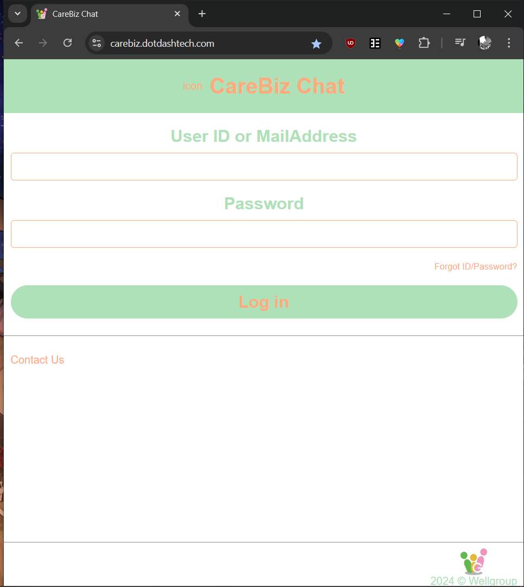
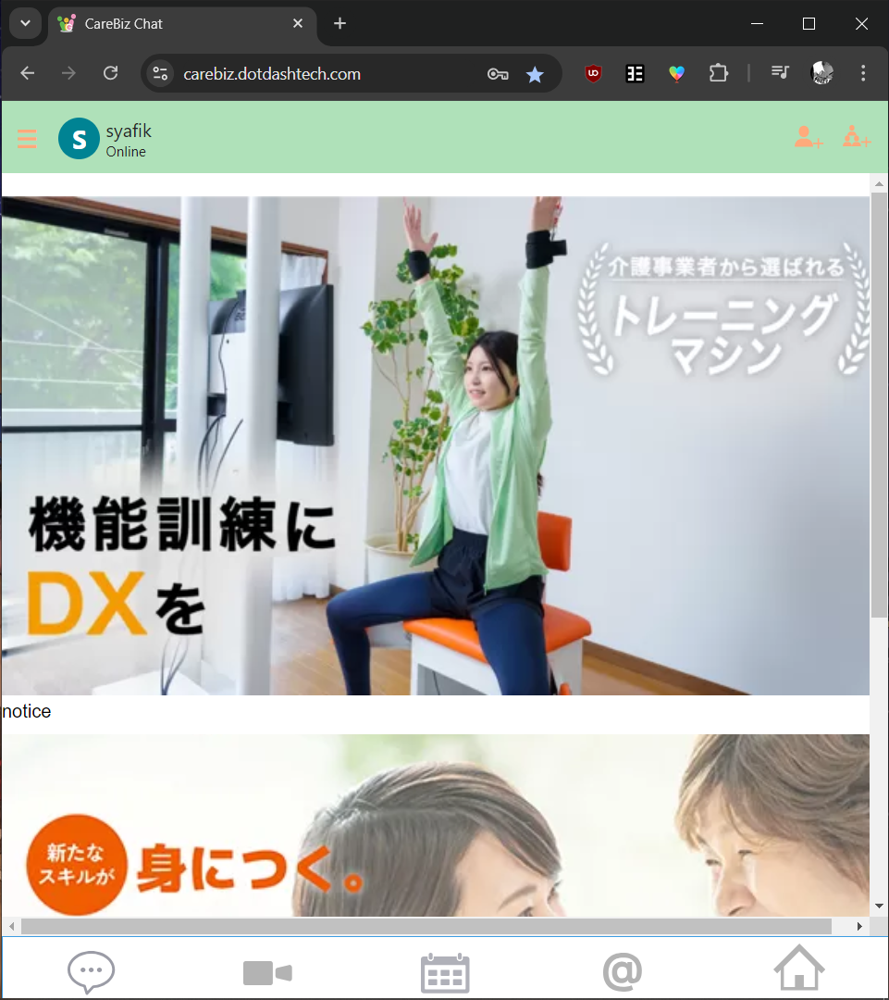

Login
=====

For this section, we assume that you are using CareBiz with unified login. This means accounts will be provided to users by an Admin, 
after request by the user.

.. centered:: |image1|

Once you're logged in, there will be five buttons at the bottom of the screen. That is the navigation bar for the site.

.. centered:: |image2|

These buttons are:

.. Make a reference to Main Apps for each section of the bullet points below

- Home Page   —  The current page you are viewing after logging in. Relevant site news, notices and ads are on this page!
- Chatroom    —  Where you can contact your friends and other users of the site. DM them directly, or create a group and start chatting!
- Video Meet  —  Meet and chat directly with your friends and associates. You can schedule your meeting or start one immediately!
- Calendar    —  

.. Explain the 5 icons visible at the bottom. Cross refence them into their own seperate section that provides more details
   Only give quick description of it here - 

   
