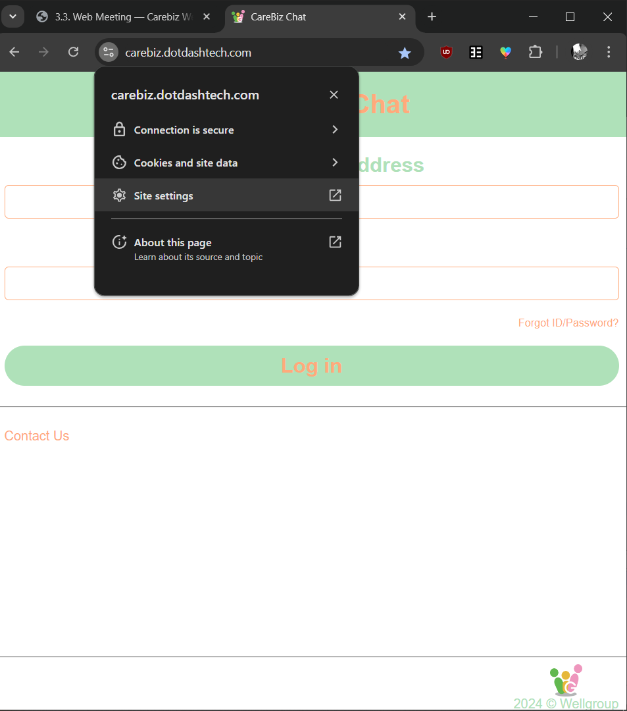
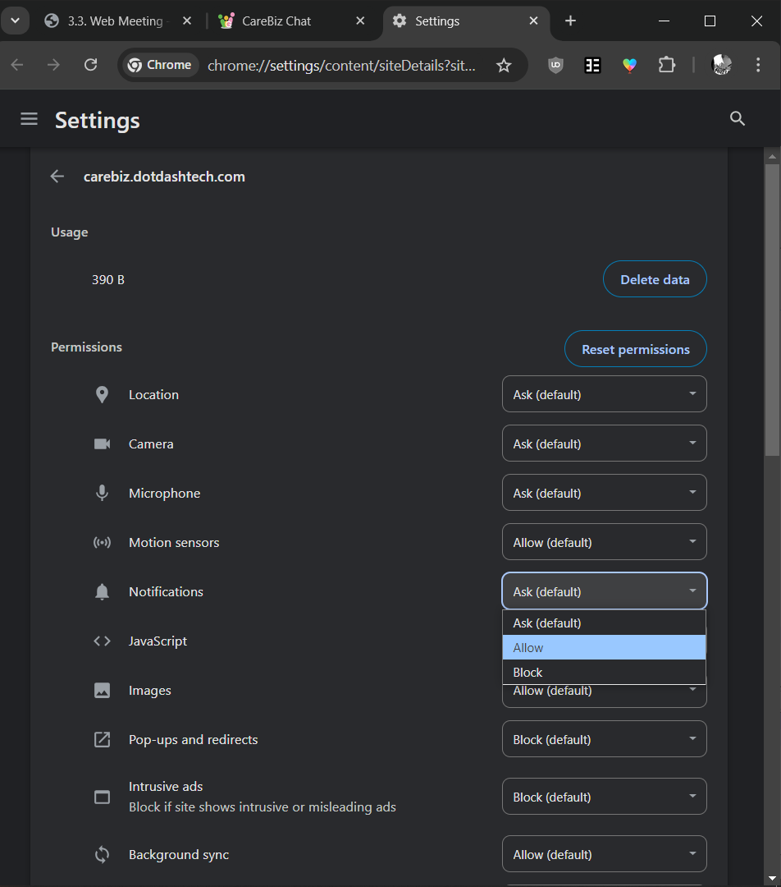

Frequently Asked Questions (FAQ)
================================

.. BOSH server not reachable

..   There are two main reasons why you can not reach your BOSH server:
   
..   - **Reason**: Your BOSH server does not work correctly
     
..	 **Test**: Use another XMPP client, like Pidgin to verify that our HTTP binding is working as expected.
	 
..	 **Solution**: Fix your configuration ;-).
	 
..   - **Reason**: you are violating the browser same-origin-policy (SOP), which prevents cross-side requests between sites with different domains or ports (protocols).

..     **Test**: Open your JavaScript console and look for errors.

..     **Solution 1**: Enable CORS for your BOSH server. Enabled by default in ejabberd; Prosody needs 
	 ``cross_domain_bosh = true``. If you have a modified content-security-policy (as used in ownCloud), then 
	 add your BOSH domain to the ``default-src`` section.
	 
..	 **Solution 2**: Create a proxy as described in our `Apache setup guide <https://github.com/jsxc/jsxc/wiki/Prepare-apache>`__

..

.. Glossary

.. _reference to JID:

What is a JID
~~~~~~~~~~~~~
   
JID is short for "Jabber ID", from the initial name of XMPP. The ID used for identifying XMPP users, c.f. :ref:`the user manual's 
Introduction section <reference to General Information>`.
  
..
  
.. OTR
  
.. Off-The-Record messaging; a mechanism to model secure communication along the lines of a personal, private discussion. It provides repudiation, i.e., any party can later plausibly deny to third parties they did not say this.
   
..   
   
.. SMP
   
.. `Socialist Millionaires Protocol <https://en.wikipedia.org/wiki/Socialist_millionaire>`_; a user-friendly protocol to mutually authenticate two humans who already share some information.
   
..

.. WISEchat

.. Web-Integrated, Secure, Enhanced Chat; the concept of enabling secure multi-media communications directly from the web browser. JSXC is our implementation of this concept.
      
.. _reference to XMPP:

..

.. XMPP

.. Extensible Messaging and Presence Protocol, formerly known as Jabber; an Internet standard and open protocol for instant messaging. The XMPP servers by default automatically build a federation, allowing  presence information and messages being shared by users according to their privacy preferences, reducing the impact of security breaches.

.. In most organizations, the XMPP username ("JID") corresponds to the (mnemonic) email address, reducing  the need to remember additional (non-mnemonic) telephone numbers, even for audio conversations, and thus paving the way toward real Unified Communications. More information can be found in :ref:`the user manual <reference to General Information>`.

..

.. _reference to turning on Notifications:

How do I enable Notifications / Webcam / Microphone?
~~~~~~~~~~~~~~~~~~~~~~~~~~~~~~~~~~~~~~~~~~~~~~~~~~~~

If you're not getting notifications, then its likely cause you've blocked or haven't allowed your browser's permissions to accept and show you carebiz notifications.
If you're on browser, you can manually set site permissions by following the steps below:

   .. centered:: |image_hamburger|

   1. Click on the hamburger/lock icon beside your browser's search bar. Then click on Site Permissions.
   If Site Permissions isn't a button in the drop down, then click on something called Site Settings (or similar) instead.
   
   .. centered:: |image_permissions|
   
   2. Once you're on the permissions page, scroll until you find Notification Permissions, and change it to allow.
   
If you're trying to enable Webcam or Microphone, the process is the same as the steps above. Just search for Camera Permissions or Microphone permissions instead.

The site still does not support manual change of permissions for phone/tablet users, as of 9 Sept 2024.

   
