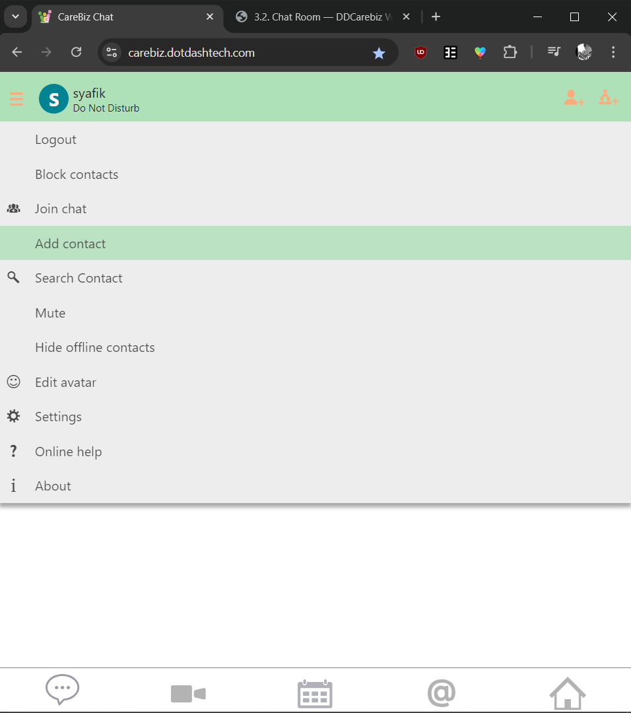
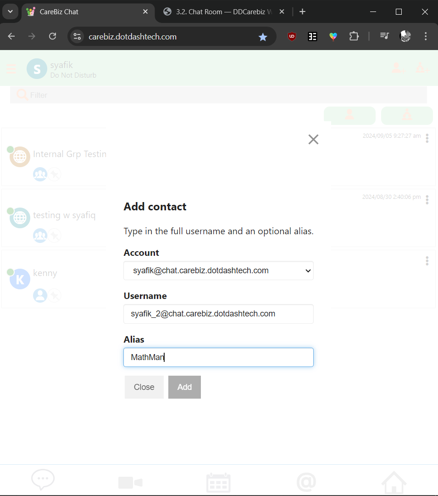

Chat Room
---------

If you have previously used a different (company name) client with the same JID, your contacts list will be automatically filled with the same contacts
you've already added on previous clients. Otherwise, you'll have to add people into your contacts like below.

.. _reference to Adding a Contact:

.. centered:: |image1|

..

Adding a Contact
~~~~~~~~~~~~~~~~

To add a contact, click on the hamburger icon at the top left corner and select Add Contacts; then enter 
the JID (typically the email address) of your buddy, optionally with a (nick) name under which the buddy 
should be shown in your contacts list. This nick name is only visible to you; so feel free to make them easy for 
you to remember! 

You can always change the name to to a different nickname or to show the JID again later!

.. centered:: |image2|

.. centered:: |image3|

.. centered:: |image4|

.. _reference to Creating a Group Chat:

Creating a Group Chat
~~~~~~~~~~~~~~~~~~~~~

You can also make a group chat! To make one, click on the Hamburger and then the Join Chat button. You can also make one by clicking on the top right's Group Icon!

.. centered:: |image5|

.. centered:: |image6|

Afterwards, search for and click on your buddy's account. You can choose as many as you want. Then click on the 'Create' button and the Group Chat is made!

.. centered:: |image7|

With that, you can start to chat with your friends or coworkers! Just click on one of your contacts and you will be directed to their chat 
window. To chat with a different friend or group, click on the X on the top right or the name of the current contact or friend group.

Reopening a chat window will restore the **chat history**. Do note however, that the chat history is not viewable across devices. 
That means your account cant see messages you've sent through your laptop on your phone, or vice versa.

The actual chat process is straightforward: Type into the **Message** input field and hit return; your message 
and the answers will appear in the chat window.

Managing Chat
~~~~~~~~~~~~~

Once you have a lot of people in your Contacts List, you might have trouble finding specific contacts, users who are online, or remembering who your contact named
'Backpain Doctor' is. That's why we have features to help manage you manage it for ease of use.

.. _reference to Hide Offline Users:

|   1. **Hide Offline Users**
|    
|   When you only want to see those who are online, you can select 'Hide Offline' from the Hamburger menu (aka the topleft icon).
    **If you can't find a specific contact in your Contacts List to message, then they're probably Offline and hidden now.**
	To access their chat again, change back to 'Show Offline' mode in the topleft icon's menu.

|   2. **Search for Specific Contact**
|    
|   Once your chat gets too big, it might take a while to scroll through your Contacts List to find one specific person you want to message.
    To manage this, you can simply use the search bar on top of the Contacts List, and type the name of the contact you're trying to find.
	If you can't find a specific user through the search, then it's probably because you're in :ref:`'Hide Offline Contact' mode! <reference to Hide Offline Users>`

.. _reference to Modifying a Contact:

|   3. **Modifying a Contact**
|
|   Click on the Meatball Icons (aka 3 Dots) on the right of the contact's name in chat. 
    There will be 4 buttons on the menu, a Pen icon, a Group icon, a Letter I icon, and a trash bin icon.
    
	- The Pen icon allows you to edit your contacts' displayed name in the chat. The name you entered will be active 
	  on all your XMPP clients connecting to this account. Other users, including the contact, will not know what you have entered there.
	
|image8|
	
	- The Group icon is another way for you to invite the contact into your :ref:`group chat! <reference to Creating a Group Chat>`
    
	- The Letter I icon displays your contacts/group chat information, such as their JID account name, their custom user Status, 
	  their online status, or the participants of the group chat.
	
|image9|
	
    - Finally, the Trash Bin icon removes the account from your Contacts List. You or the other account will have to add each other back to look at the chat history or message each other again.

Setting Your Status
~~~~~~~~~~~~~~~~~~~

You can tell your contacts whether you are available, e.g. by setting the status to **away** or **do not disturb**. 
Your contacts will see this by the colored bar left of their contacts list entry for you which will change to yellow 
or red as a result of this choice.

.. centered:: |image10|

You can also filter your chat by hiding all users or chat groups that are offline. In the hamburger icon on the top bar,
you can click on the 'Hide offline contacts' option to show only users or group chats with people who are online. 

.. centered:: |image11| 

Users with 'Offline' status are treated as if they're logged out by the chat system. You can't view chat nor receive messages from it until 
the status is changed back to 'Online', 'Away', 'Extended Away' or 'Do Not Disturb'.

.. centered:: |image12|

Once you're back online, you'll be redirected to the Home Page, the chat will be re-enabled, and you will receive messages your contacts sent to you while you were offline.

..

   

   

   

   

   

.. |image9| image:: ../media/Main_Apps/chat_room/image9.png
   :width: 480px
   :height: 540px
   

   

   
