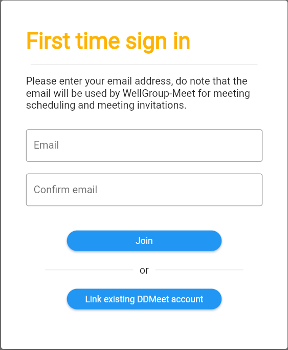
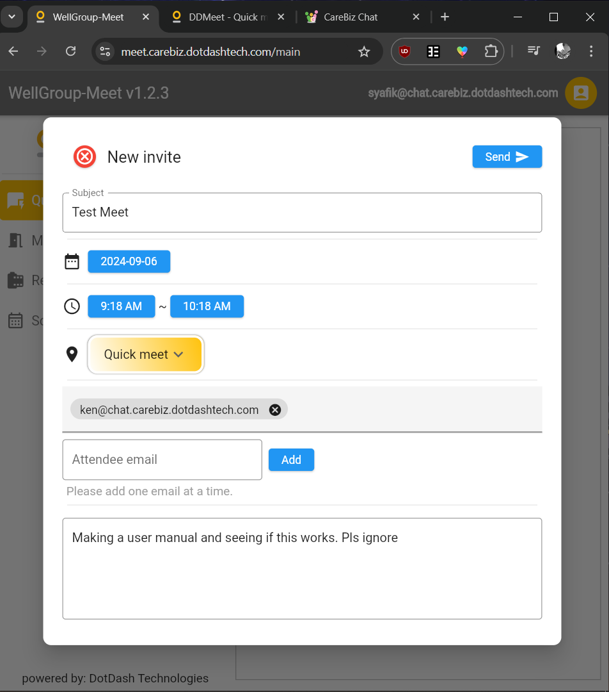
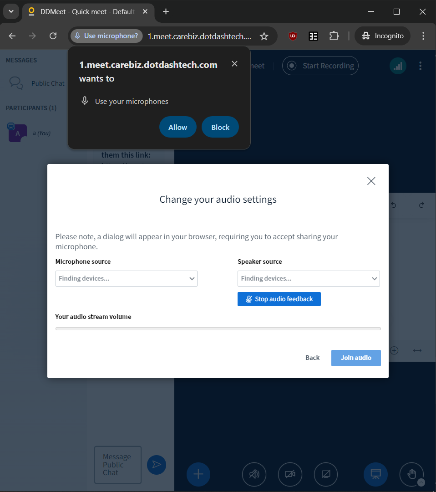
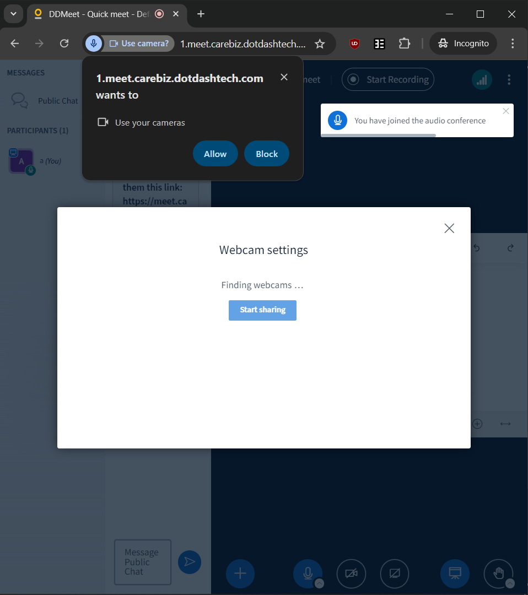
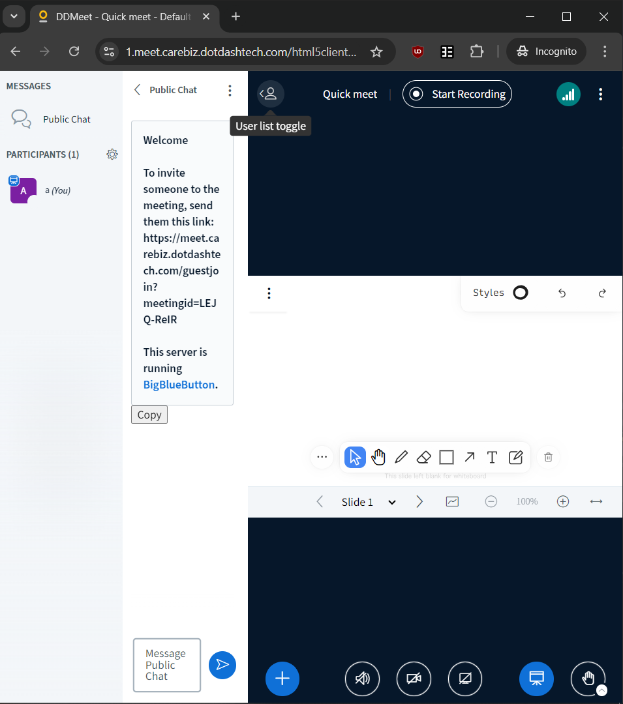

Web Meeting
-----------

First Time Login
~~~~~~~~~~~~~~~~

To start a video chat, click on the camera icon (right of the chat icon).

You will be redirected to a different page where you'll be asked to key in your JID.
If your JID / Carebiz Email account is already registered as an existing user for the meeting site, simply fill in your ID at the fields provided below and click join to login.

.. centered:: |image_login|

If your JID /Carebiz Email Account isn't yet registered, but you have an existing DDMeet account, you may simply click Link an Existing DDMeet account, and then provide the Email and Password
for that DDMeet account to login.

Quick Meet
~~~~~~~~~~

You will be in a new page/tab, and see a side bar with 4 buttons on the left, and three different meeting buttons/options on the right. 
This is the Quick Meeting page, where you can join, make and plan meetings with other users!

.. centered:: |quick_meet|

If you're going to create a new meeting, click on 'Start a meeting now'! After entering your name in the prompt that pops up, you will then be redirected to 
the meet room.

.. centered:: |room_info|
 
Share the room ID from the image above, and people can participate in the meet using either the Join room with ID button in Quick Meet, or from their My Rooms navigation page.

.. centered:: |join_room_with_id|

You can also schedule a meeting in advance! Click on the 'Schedule a meeting for later button' and you'll be able to send an invite at your scheduled time.
Type the Subject of the meeting, the participants of the meeting, and also the details of the meeting (optional), and you're all set!

.. centered:: |schedule_meeting|

You can view all of your scheduled meetings under the Calendar tab, and either start or adjust the time and people invited to the meeting whenever you want.
Once about an hour has passed since the meeting room starts, it will terminate automatically. The meeting room will leave a prompt about a it 30 minutes 
before terminating.

.. _reference to Meeting Room:

The Meeting Room
~~~~~~~~~~~~~~~~

.. centered:: |master_image|

Now that you've created (or joined) a meeting room, it's time to get acquainted with the rooms' functions!

1. Talking and Chatting

   Upon entering the room, the site will prompt whether you'd be joining the call with Microphone or Audio only. To protect your privacy, the web 
   browser will require confirmation before allowing CareBiz access to your microphone. The same prompt will appear when you click on and activate the camera for the first time.
   
   .. centered:: |mic_permissions|
   
   .. centered:: |video_permissions|
   
   In case you've blocked permission for both functions and want to turn it back on, simply click on the icon beside your browser's search bar, and :ref:`reset site permissions to allow the prompt again <reference to turning on Notifications>`.
   
   The meeting room's text chat can be accessed by clicking on the User List Toggle button on the top left. Admins in particular are also able to mute participants in this menu. 
   This is also where you can see other participants of the call, get the link to share the meeting room, or to participate in any polls that the admin of the meet started.
   
   .. centered:: |user_toggle_list|
   
   You can also emote and react using the button on the bottom right of the meeting room. Click on the button to raise your hand, or on the arrow beside it to change the emote.

2. The Whiteboard and other Activities

   In the middle of the room, presented by default, is the whiteboard. Here you can write notes, make shapes, draw doodles and many more for the rest of the team to see!
   Other people in the call can also doodle on the whiteboard, if Turn Multi User Whiteboard button is pressed. There are about 13 slides to doodle on, and easy ways to undo and erase things on the board.
   So feel free write as much as you want to communicate your ideas with your team!
   
   If you want to change the color or style of your drawings, text or other graphic on the whiteboard, just click on the Style button on the top right of the whiteboard
   and create a new drawing/line/graphic.
   
   You can share and doodle on your own office files/documents as well! Just click on the plus sign on the bottom left, and click on Upload/Manage Presentations!
   Afterwards, just drag and drop the file into the box in the page below, and click the Upload button on the top right.
   
   .. centered:: |upload_office_file|
   
   You can even download and share the doodles afterwards! Go back to the Uploading/Managing Documents page, and just click the send to chat button beside the file name.
   Other than the whiteboard, you can also interact with your participants in other ways. The Action button (the '+' button on the bottom left) also lets you start polls and share videos, whereas
   the Share Your Screen button lets you share a window, tab, or an entire screen for a presentation. 

3. Managing Your Presentations

   The meeting room have a few functions to help you manage your meeting, by either muting participants, creating breakout rooms, or changing
   the layout of the meeting to focus on particular users/the presentation. Admins can mute participants and create breakout rooms through the 
   user toggle list, under the participant tab. Every user can change the layout of the presentation to 4 choices of layout, although admins 
   are able to push a particular layout for everyone present themselves.

Enjoy!

   
.. |room_info| image:: ../media/Main_Apps/video_meet/room_info.png
   :width: 713px
   :height: 759px
   
.. |quick_meet| image:: ../media/Main_Apps/video_meet/quick_meet.png
   :width: 713px
   :height: 759px
   

   
.. |master_image| image:: ../media/Main_Apps/video_meet/master_image.png
   :width: 720px
   :height: 810px

.. |upload_office_file| image:: ../media/Main_Apps/video_meet/upload_office_file.png
   :width: 480px
   :height: 356px
   

   

   
.. |join_room_with_id| image:: ../media/Main_Apps/video_meet/join_room_with_id.png
   :width: 713px
   :height: 759px